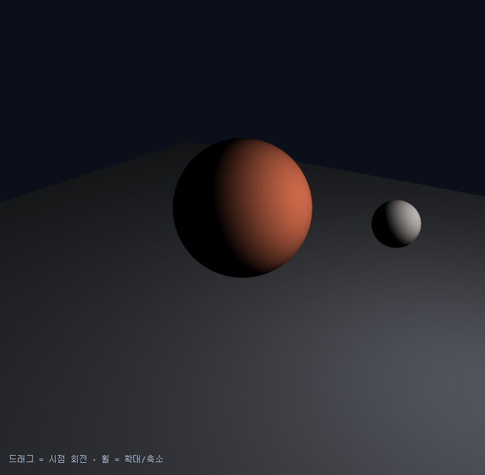
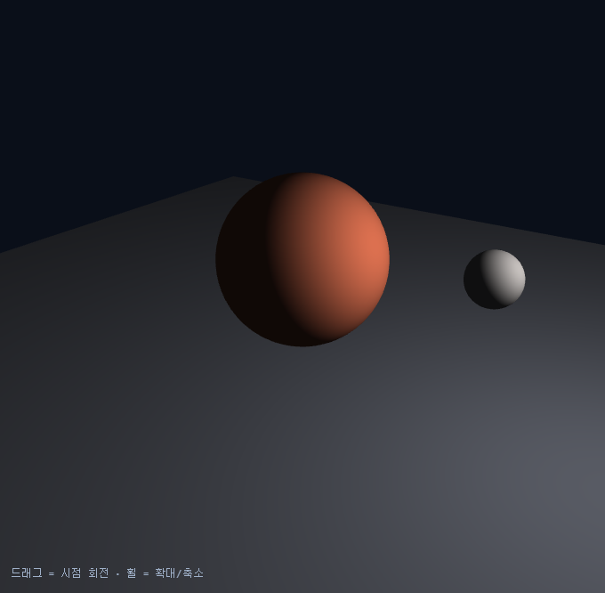
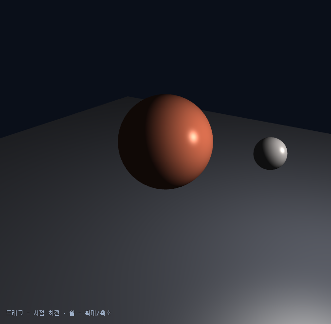
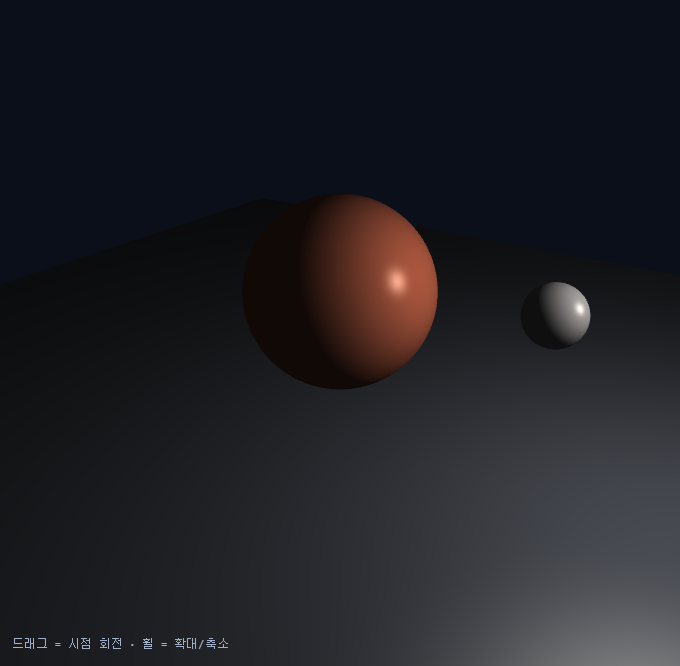
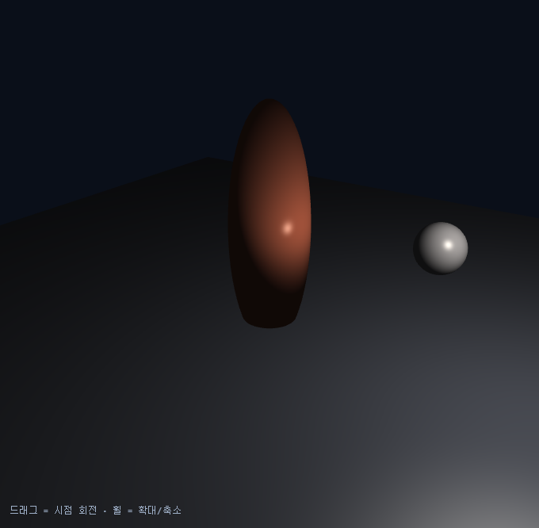
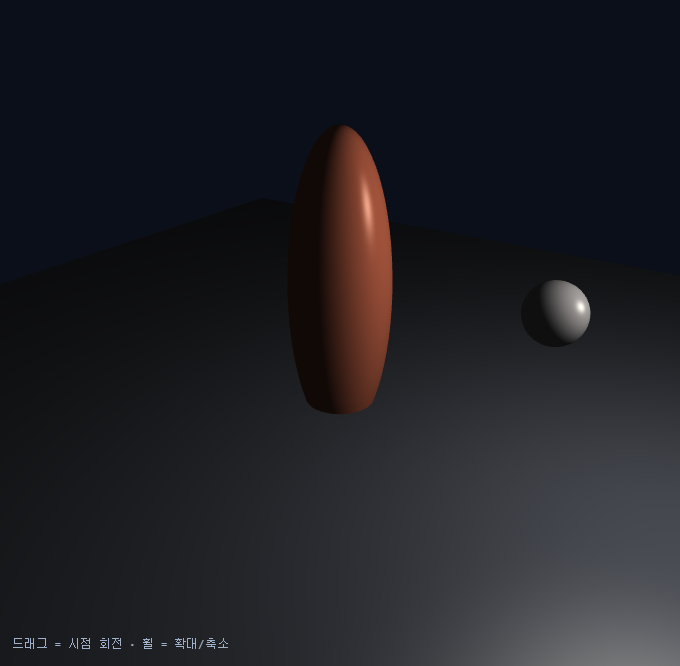
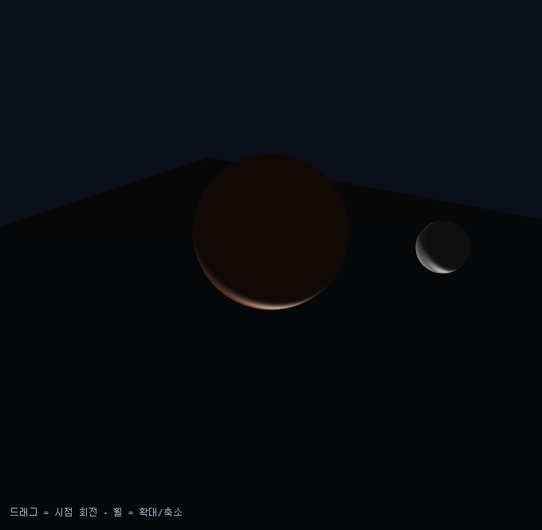
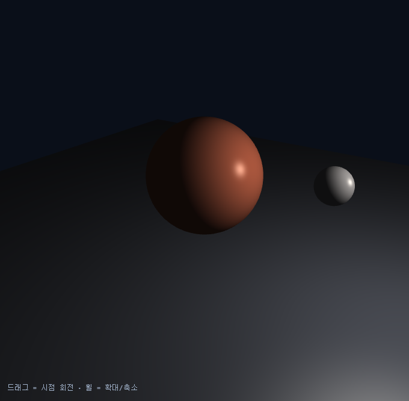
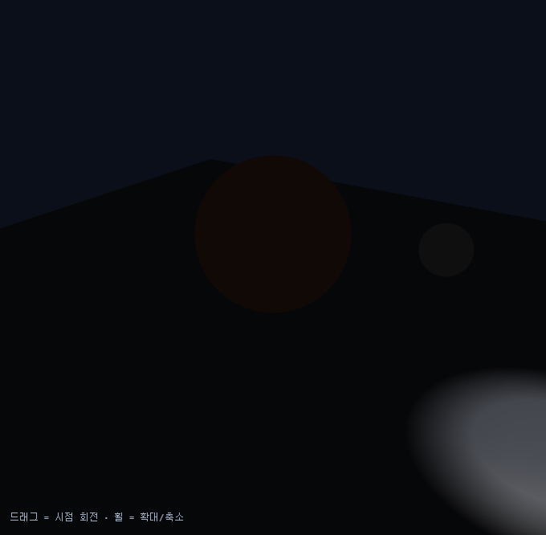

# 5주차 과제 — 빛과 색

## 실습 1: 태양 하나로 만드는 낮과 밤

### 제출 항목
1. 단계 1~4 캡처 4장 (같은 각도)
2. 단계 1의 `max` 제거 예측과 실제 결과
3. 단계 5 비교 캡처 2장 (`mat3(uModel)` vs `uNormalMat`, 비균등 스케일)
4. 단계 6에서 광원 종류를 바꾼 캡처와 차이 설명

### 캡처 목록
- 0단계: 출발 화면
- 1단계: 확산광
- 2단계: 환경광
- 3단계: 정반사
- 4단계: 거리 감쇠
- 5단계: 법선 행렬 비교

### 1) 단계 1~4 관찰
- 1단계: 
- 2단계: 
- 3단계: 
- 4단계: 

### 2) `max` 제거 실험
- 예측: `max(dot(N, L), 0.0)` 에서 `max` 를 지우면, 빛을 등진 면의 내적 값이 음수로 그대로 들어간다. 그러면 확산광이 0 에서 멈추지 않고 음수로 계산되어, 밤쪽이 단순히 어두워지는 것이 아니라 색이 비정상적으로 꺼지거나 뒤틀려 보일 것이다.
- 실제: `max` 를 제거하자 빛을 받지 않는 면이 검게 정리되지 않았고, 밤쪽이 자연스럽게 어두워지지 않았다. 경계가 깨져 보이고 화면의 일부가 이상하게 어두워지거나 부자연스럽게 보였다. 즉, `max` 는 음수를 0 으로 잘라 주어 확산광이 물체의 밝기를 망가뜨리지 않도록 막아 주는 역할을 했다.

### 3) 단계 5 법선 행렬 비교
- `mat3(uModel)` 캡처: 
- `uNormalMat` 캡처: 
- 차이: `mat3(uModel)` 을 쓰면 비균등 스케일이 들어간 물체에서 법선이 함께 찌그러져 조명이 어긋난다. 반면 `uNormalMat` 은 역전치 기반의 법선 행렬이라 표면의 방향을 올바르게 보정해 주므로, 밝은 면과 하이라이트가 물체의 실제 형태에 맞게 붙는다.

### 4) 단계 6 광원 종류 비교
- directional: 
- point: 
- spot: 
- 차이: directional 은 광원의 방향만 일정하게 적용되므로 거리 감쇠가 없어 화면 전체가 비교적 고르게 밝다. point 는 광원 위치를 기준으로 거리에 따라 밝기가 줄어들어 가까운 물체가 더 강하게 드러난다. spot 은 point 의 감쇠에 더해 원뿔 범위 밖이 잘려 나가므로, 빛이 닿는 영역이 가장 제한적이고 무대 조명처럼 특정 부분만 강조된다.

## 실습 2: 빛으로 분위기 만들기

### 의도

### 방법

### 최종 결과
